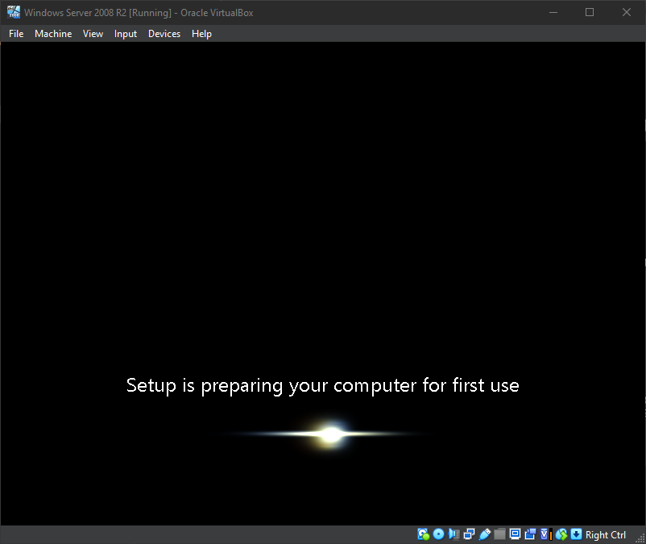

# **Windows Installation**

!!! warning
    TAKE THIS NOTE SERIOUSLY

    Others in the forum I have visited have reported loop issues during installation.

    I suggest you read through all steps to avoid the same fate. 

    **BE PATIENT, AND READ**

---

## **Region Select**

After starting the machine for the first time, the first screen to pop up will be this


Just click **```Next```** to proceed to the next step.

---


Here, you will click **```Install now →```** then the setup will start

---

## **OS Selection**

After the setup has completed, A window will ask us which Operating System we wish to install. For this guide, we will just instull the **```Standard (Full Installation)```**. Choose that option and click **```Next```** then accept the agreement.


---

## **Installation Type Selection**

After accepting the agreement, we will be asked which type of installation do we want. For this choose **```Custom (advanced)```**.

!!! warning
    **DO NOT CHOOSE UPGRADE!!!**

    You will not be able to upgrade a non-existing system. There was no OS before.

    <!-- [referenced video](https://youtu.be/WSRbSbVZ0aM?t=380) -->


---

## **Disk Selection**

On this part, keep **```Disk 0```** selected and click **```Next```**


---

## **Installation Begins**

Once you reach this point, keep your fingers out of the keyboard. Do not do **```Alt + Tab```** when changing tabs. just click them from your taskbar. 

!!! note
    The process may cause some reboots. That's normal. Just wait it out and be patient.


The image below is the reason why you can't touch your keyboard during this part of the installation. As reported [here](https://youtu.be/WSRbSbVZ0aM?t=380), pressing any key at this part may cause looping during installation. 

**Just be patient and let the installation go through on its own.**


Black screens like these are progress. Just wait them out. Your virtual Machine will be installed soon.


---

## **Light After Darkness**

Once you reach this point you are saved. This light gives you the signal to touch that keyboard again.



---

## **Password Setup**

Upon encountering this message just click **```OK```** and proceed to set up your new password. One that you will remember. After doing that the virtual machine will proceed with its setup.


---

## **Installation Success!!!**

Congratulations, you have now installed Windows Server 2008 R2


Wait for a few moment and **```Initial Configuration```** window will pop up. Feel free to configure this as you like.


---

## **Logging in through VirtualBox**

Others may find this weird as their usual key combination does not work ***(Windows Key + Del)***. 

With it, just look at the bottom-right part of the Virtual Machine's window. On the example below you can see **```Right Ctrl```** This means my combination for it is ***(Right Ctrl + Del)***.


If in any case that was changed on your VirtualBox, just go to your VirtualBox' **```Preferences > Input > Virtual Machine```**
and find the key or key combination assigned to it.

---